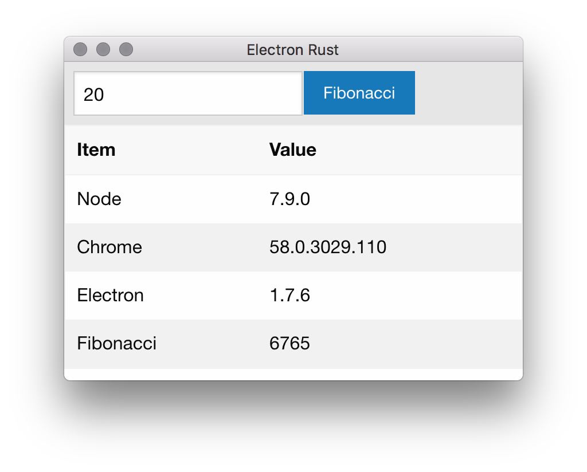

# Electron Rust
Electron + Rust. Hides Rust source in the packaged Electron project. Only the dll is used.

## Requires

* Yarn `npm i -g yarn`
* Cargo Make `cargo install cargo-make`

## Build & Run
* `yarn` will download required node packages.
* `cargo build` will download and build the rust source.
* `cargo make copy_lib` will copy the library into the resources folder*
* `./node_modules/.bin/electron-rebuild` will build against the right npm packages for your Electron's version of Node.
* `.\node_modules\.bin\electron-rebuild.cmd` for Windows.
* `yarn start` will start the app.
* `yarn run dist` will package your app with Electron Builder.

You only need to run electron-rebuild when you add a new npm package. More info: https://github.com/electron/electron-rebuild

*To build Rust source and copy the library at the same time, you can use `cargo make dbuild`. Edit `Makefile.toml` and `Cargo.toml` to suit your platform. See the Cargo Make docs: https://sagiegurari.github.io/cargo-make/